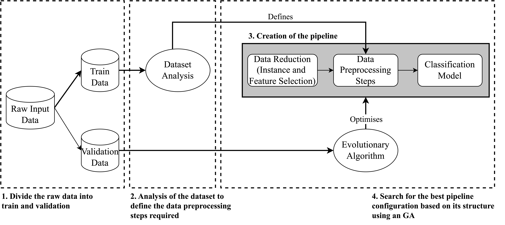

# EDCA – An Evolutionary Data-Centric AutoML Framework for Efficient Pipelines

EDCA is a low-cost AutoML capable of creating simpler but efficient ML solutions.

## What is EDCA?

EDCA is a Python library for Automated Machine Learning (AutoML). It optimizes the entire ML pipeline. Given a classification dataset, EDCA starts by making an analysis of the features types and characteristics. This analysis serves to define the data transformations required for the data in question. Then, with the pipeline steps required, it starts the search for its bests estimators and models for each step of the pipeline. The search relies on a Genetic Algorithm. In the end, the user receives the best pipeline found ready to make predictions over unseen data.



## Installation

    pip install -r requirements.txt

or

    conda env create -f environment.yml

## Getting Started

    cd src
    python main.py config.json

This enables to run EDCA or two other SOTA frameworks FLAML and TPOT for comparison.

## Repository Structure

- ***analysis***: Folder containing all the notebooks to analyze EDCA
- ***data***: Folder to store data (datasets used, metadata of the datasets, results, etc)
  - ***dataset***: Stores the datasets used on the experiments
  - ***metadata***: Contains metadata of the datasets used
  - ***...***: Other folders will be created with the results after running the experiments
- ***docs***: Contain documents detailing EDCA and the results achieved with it.
- ***images***: Stores the images
- ***src***: Contains the source code of the project
  - ***edca***: Contains EDCA's source code
  - ***notebooks***: Contains additional notebooks to transform the results of the raw experiments, retrain individuals and create datasets
  - ***main.py***: Main file to run the experiments. Receives the ***config.json*** file as a parameter on the terminal
  - ***utils.py***: Contains functions to test the frameworks
  - ***config.json***: Contains the config to run EDCA
  - ***train_flaml.py***: Auxiliary script to retrain the best  solutions found in FLAML with EDCA's selected data after the initial experiments. It is not necessary to run this if both training FLAML and EDCA flags are active when running *main.py*
  - ***train_tpot.py***: Auxiliary script to retrain the best  solutions found in TPOT with EDCA's selected data after the initial experiments. It is not necessary to run this if both training TPOT and EDCA flags are active when running *main.py*
  - ***retrain_individual.py***: Auxiliary script in case of required to re-train an individual based on a given config or based on the config achieved by an experiment

Note: Inside most directories there is a *README.md* detailing its content.

## Contact

- Joana Simões (<joanasimoes@dei.uc.pt>)
- João Correia (<jncor@dei.uc.pt>)

## Cite Us

```bibtex

@mastersthesis{simoes2024data,
  title={Data Centric Optimisation in AutoML},
  author={Sim{\~o}es, Joana Maria Silva},
  url={https://estudogeral.uc.pt/handle/10316/118054?locale=en},
  year={2024}
}

@article{simoes2025edca,
  title={EDCA--An Evolutionary Data-Centric AutoML Framework for Efficient Pipelines},
  author={Sim{\~o}es, Joana and Correia, Jo{\~a}o},
  journal={arXiv preprint for the EvoApps 2025},
  year={2025},
  url={https://arxiv.org/abs/2503.04350}
}
```
